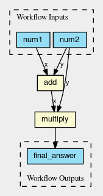

scriptcwl
=========

|codacy_grade| |codacy_coverage| |travis| |documentation| |pypi_version| |pypi_supported| |zenodo|

scriptcwl is a Python package for creating workflows in
`Common Workflow Language (CWL) <http://www.commonwl.org/>`_. If you give it a number of CWL
``CommandLineTools``, you can create a workflow by writing a Python script. This can
be done interactively using `Jupyter Notebooks <http://jupyter.org/>`_. The full
documentation can be found on `Read the Docs <http://scriptcwl.readthedocs.io/en/latest/>`_.

Given CWL ``CommandLineTools`` for ``add`` and ``multiply`` (these are available
in `scriptcwl <https://github.com/NLeSC/scriptcwl/tree/master/scriptcwl/examples>`_),
a CWL specification of this workflow can be written as:

.. code-block:: python

  from scriptcwl import WorkflowGenerator

  with WorkflowGenerator() as wf:
    wf.load(steps_dir='/path_to_scriptcwl/scriptcwl/examples/')

    num1 = wf.add_input(num1='int')
    num2 = wf.add_input(num2='int')

    answer1 = wf.add(x=num1, y=num2)
    answer2 = wf.multiply(x=answer1, y=num2)

    wf.add_outputs(final_answer=answer2)

    wf.save('add_multiply_example_workflow.cwl')

The workflow has two integers as inputs (``num1`` and ``num2``), and first adds
these two numbers (``wf.add(x=num1, y=num2)``), and then multiplies the answer
with the second input (``num2``). The result of that processing step is the output
of the workflow. Finally, the workflow is saved to a file. The result looks like:

.. code-block:: sh

  #!/usr/bin/env cwl-runner
  cwlVersion: v1.0
  class: Workflow
  inputs:
    num1: int
    num2: int
  outputs:
    final_answer:
      type: int
      outputSource: multiply/answer
  steps:
    add:
      run: add.cwl
      in:
        y: num2
        x: num1
      out:
      - answer
    multiply:
      run: multiply.cwl
      in:
        y: num2
        x: add/answer
      out:
      - answer

The Python and CWL files used in the example can be found in the `examples folder <https://github.com/NLeSC/scriptcwl/tree/master/scriptcwl/examples>`_.

Installation
############

Install using pip:

.. code-block:: sh

  pip install scriptcwl

For development:

.. code-block:: sh

  git clone git@github.com:NLeSC/scriptcwl.git
  cd scriptcwl
  python setup.py develop

Run tests (including coverage) with:

.. code-block:: sh

  python setup.py test

Useful tools
############

To use scriptcwl for creating CWL workflows, you need CWL ``CommandLineTools``.
There are some software packages that help with generating those
for existing command line tools written in Python:

* `argparse2tool <https://github.com/erasche/argparse2tool#cwl-specific-functionality>`_: Generate CWL CommandLineTool wrappers (and/or Galaxy tool descriptions) from Python programs that use argparse. Also supports the `click <http://click.pocoo.org>`_ argument parser.
* `pypi2cwl <https://github.com/common-workflow-language/pypi2cwl>`_: Automatically run argparse2cwl on any package in PyPi.
* `python-cwlgen <https://github.com/common-workflow-language/python-cwlgen>`_: Generate CommandLineTool and DockerRequirement programmatically

License
#######

Copyright (c) 2016-2018, Netherlands eScience Center, University of Twente

Licensed under the Apache License, Version 2.0 (the "License");
you may not use this file except in compliance with the License.
You may obtain a copy of the License at

http://www.apache.org/licenses/LICENSE-2.0

Unless required by applicable law or agreed to in writing, software
distributed under the License is distributed on an "AS IS" BASIS,
WITHOUT WARRANTIES OR CONDITIONS OF ANY KIND, either express or implied.
See the License for the specific language governing permissions and
limitations under the License.

.. |codacy_grade| image:: https://api.codacy.com/project/badge/Grade/8f383bca18384d8187c10c27affa9d53
                     :target: https://www.codacy.com/app/jvdzwaan/scriptcwl?utm_source=github.com&amp;utm_medium=referral&amp;utm_content=NLeSC/scriptcwl&amp;utm_campaign=Badge_Grade

.. |codacy_coverage| image:: https://api.codacy.com/project/badge/Coverage/8f383bca18384d8187c10c27affa9d53
                       :target: https://www.codacy.com/app/jvdzwaan/scriptcwl?utm_source=github.com&amp;utm_medium=referral&amp;utm_content=NLeSC/scriptcwl&amp;utm_campaign=Badge_Coverage

.. |travis| image:: https://travis-ci.org/NLeSC/scriptcwl.svg?branch=master
              :target: https://travis-ci.org/NLeSC/scriptcwl

.. |documentation| image:: https://readthedocs.org/projects/scriptcwl/badge/?version=latest
                    :target: http://scriptcwl.readthedocs.io/en/latest/?badge=latest

.. |pypi_version| image:: https://badge.fury.io/py/scriptcwl.svg
                    :target: https://badge.fury.io/py/scriptcwl

.. |pypi_supported| image:: https://img.shields.io/pypi/pyversions/scriptcwl.svg
                      :target: https://pypi.python.org/pypi/scriptcwl

.. |zenodo| image:: https://zenodo.org/badge/70679474.svg
                      :target: https://zenodo.org/badge/latestdoi/70679474
                      :alt: DOI
