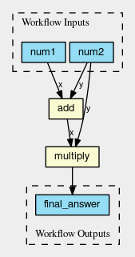

.. scriptcwl documentation master file, created by
   sphinx-quickstart on Mon Nov 13 15:12:14 2017.
   You can adapt this file completely to your liking, but it should at least
   contain the root `toctree` directive.

Welcome to the Scriptcwl Documentation!
=======================================

Scriptcwl is a Python package for creating `Common Workflow Language (CWL) <http://www.commonwl.org/>`_ workflows.

Given CWL ``CommandLineTools`` for ``add`` and ``multiply`` (these are available
in `scriptcwl <https://github.com/NLeSC/scriptcwl/tree/master/scriptcwl/examples>`_),
a CWL specification of this workflow can be written as:
::

  from scriptcwl import WorkflowGenerator

  with WorkflowGenerator() as wf:
      wf.load(steps_dir='/path_to_scriptcwl/scriptcwl/examples/')

      num1 = wf.add_input(num1='int')
      num2 = wf.add_input(num2='int')

      answer1 = wf.add(x=num1, y=num2)
      answer2 = wf.multiply(x=answer1, y=num2)

      wf.add_outputs(final_answer=answer2)

      wf.save('add_multiply_example_workflow.cwl')

The workflow has two integers as inputs (``num1`` and ``num2``), and first adds
these two numbers (``wf.add(x=num1, y=num2)``), and then multiplies the answer
with the second input (``num2``). The result of that processing step is the output
of the workflow. Finally, the workflow is saved to a file. The result looks like:
::

  #!/usr/bin/env cwl-runner
  cwlVersion: v1.0
  class: Workflow
  inputs:
    num1: int
    num2: int
  outputs:
    final_answer:
      type: int
      outputSource: multiply/answer
  steps:
    add:
      run: add.cwl
      in:
        y: num2
        x: num1
      out:
      - answer
    multiply:
      run: multiply.cwl
      in:
        y: num2
        x: add/answer
      out:
      - answer

More examples of workflows created using scriptcwl can be found under :ref:`examples`.

Contents
========

.. toctree::
   :maxdepth: 2

   loading_steps
   listing_steps
   workflow_inputs
   setting_documentation
   adding_workflow_steps
   adding_outputs
   saving_workflows
   installation
   examples
   useful_tools
   cwl_tips_tricks

API Reference
=============

.. toctree::
   :maxdepth: 2

   scriptcwl <apidocs/scriptcwl.rst>
