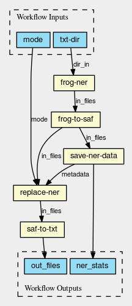

Remove named entities from a directory of text files
====================================================

In this example, we create a pipeline that replaces named entities in a collection
of (Dutch) text documents.
Named entities are objects in text referred to by proper names, such as persons,
organizations, and locations. In the workflow, named entities will be
replaced with their named entity type (i.e., PER (person), ORG (organization),
LOC (location), or UNSP (unspecified)).
The workflow can be used as part of a data anonimization procedure.

The workflow consists of the following steps:

* Extract named entities from text documents using an existing tool called `frog <https://languagemachines.github.io/frog/>`_
* Convert frog output to `SAF, a generic representation for text data <https://github.com/vanatteveldt/saf>`_
* Aggregate data about named entities that occur in the text files
* Replace named entities with their named entity type in the SAF documents
* Convert SAF documents to text

All steps required for this workflow are available through `nlppln <https://github.com/WhatWorksWhenForWhom/nlppln>`_.

Workflow
########

Scriptcwl script
################

::

	from scriptcwl import WorkflowGenerator

	with WorkflowGenerator() as wf:
	  wf.load(steps_dir='/path/to/dir/with/cwl/steps/')

	  doc = """Workflow that replaces named entities in text files.

	Input:
	  txt_dir: directory containing text files

	Output:
	  ner_stats: csv-file containing statistics about named entities in the text files
	  txt: text files with named enities replaced
	"""
	  wf.set_documentation(doc)

	  txt_dir = wf.add_inputs(txt_dir='Directory')

	  frogout = wf.frog_dir(in_files=txt_dir)
	  saf = wf.frog_to_saf(in_files=frogout)
	  ner_stats = wf.save_ner_data(in_files=saf)
	  new_saf = wf.replace_ner(metadata=ner_stats, in_files=saf)
	  txt = wf.saf_to_txt(in_files=new_saf)

	  wf.add_outputs(ner_stats=ner_stats, txt=txt)

	  wf.save('anonymize.cwl')

CWL workflow
############

::

	cwlVersion: v1.0
	class: Workflow
	inputs:
	  txt-dir: Directory
	  mode: string?

	outputs:
	  ner_stats:
	    type: File
	    outputSource: save-ner-data/ner_statistics

	  out_files:
	    type:
	      type: array
	      items: File
	    outputSource: saf-to-txt/out_files

	steps:
	  frog-ner:
	    run: frog-dir.cwl
	    in:
	      dir_in: txt-dir
	    out: [frogout]

	  frog-to-saf:
	    run: frog-to-saf.cwl
	    in:
	      in_files: frog-ner/frogout
	    out: [saf]

	  save-ner-data:
	    run: save-ner-data.cwl
	    in:
	      in_files: frog-to-saf/saf
	    out: [ner_statistics]

	  replace-ner:
	    run: replace-ner.cwl
	    in:
	      metadata: save-ner-data/ner_statistics
	      in_files: frog-to-saf/saf
	      mode: mode
	    out: [out_files]

	  saf-to-txt:
	    run: saf-to-txt.cwl
	    in:
	      in_files: replace-ner/out_files
	out: [out_files]
